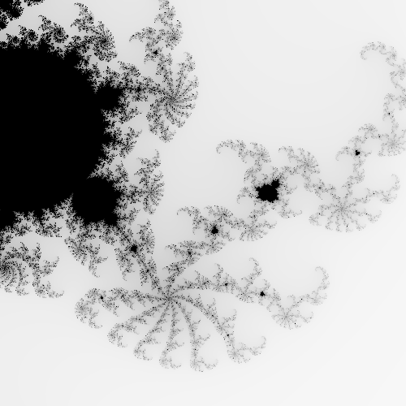

# :apple: Wasmbrot

This is a very rudimentary Mandelbrot fractal explorer written in Rust and compiled to Web Assembly [very close to this tutorial](https://rustwasm.github.io/docs/book/introduction.html).

Try it at [surt91.github.io/wasmbrot](https://surt91.github.io/wasmbrot/).



## 🛠️ Development

You need `cargo`, `wasm-pack` and `npm` installed.

Build with
```
wasm-pack build
```
and start a development server with
```
npm run start
```
